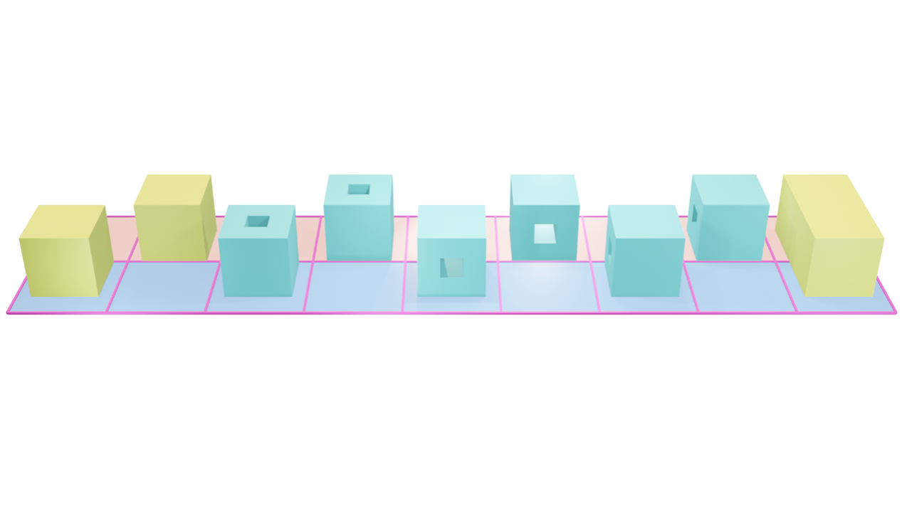

# Code Execution Guide

Ⅰ. Overview

1. This guide explains how to use the code in the paper to predict polycube structures using the ddpm-polycube algorithm.[^1]

2. The implementation is mainly in Python and Blender, using Python third-party libraries and Blender's built-in libraries.

| Environment/Library/Software | Version       | Description                                               |
| --- | --- | --- |
| Blender                       | 4.3.2         | Built-in library bpy                                      |
| python                        | 3.9           |                                                           |
| numpy                         | 1.23.5        | Keep the same version to avoid issues                     |
| torch                         | 1.10.1+cu102  |                                                           |

3. Introduction to Blender Interface and Basic Operations

The image below shows the basic Blender interface. In this workflow, we mainly focus on:
- Yellow rectangle (Viewport): display the model and adjust the current view. In the yellow oval area, drag the axis gizmo to rotate, the magnifying glass to zoom, and the hand to pan.
- Red rectangle (Code Area / Text Editor): switch, browse, and run code. The booklet-like icon switches between code files; the triangle icon executes code.
- Green rectangle (File Area / Outliner): lists all current models. Use the eye icon to show/hide models. Double-click the model name to rename.
- Blue rectangle (File menu): import models, e.g., File -> Import -> FBX (.fbx).

4. Explanation of Subdirectories

| Subdirectory      | Purpose                                                                 |
| --- | --- |
| diff_32_steps_stl | Stores the reconstructed 32-step diffusion triangle mesh result         |
| pics              | Stores images showing the diffusion process                             |
| src               | Stores source code                                                      |
| testing_models    | Stores FBX test models                                                  |
| tmp               | Stores various intermediate files output during the process             |
| training_data     | Stores the constructed training data                                    |
| v_cos             | Stores point coordinates and connectivity for training                  |
| weights           | Stores trained neural network weights                                   |

Ⅱ. Execution Process

The overall code has two parts: directly running Python files, and running Python-based scripts within Blender.

Preparation:
- Open the Blender file in the src directory (double-click to open).
- Import the model into Blender: File -> Import -> FBX (.fbx), choose a model from the model directory. Check the model name in the Outliner; if not test, rename it to test.

About parameters g1 and g2 (used when running file 2):
- When testing a model, select possible unit combinations based on the model's genus or other information.
- For two units, enter both g1 and g2. g1 represents the -x part of a 2x1 grid, and g2 represents the +x part.
- If the model consists of only one unit, set g1 = -1, and set g2 to the unit number you consider likely.

Example:
- For the “rod” model (genus=1), you might think the -x part is a cube and the +x part is a torus. Run file 2 with g1=0 and g2=3.
- For a genus 0 model, try a single basic cube: g1=-1 and g2=1.

Note: To select the best result, you may need to run multiple times with different reasonable unit combinations (e.g., for genus 1: g1=0,g2=3 or g1=0,g2=6, etc.).

Execution order:

| Step | Specific Execution Content |
| --- | --- |
| 1 | Execute File 1 in Blender |
| 2 | Execute Python file 2: `python 2_Testing.py --g1 <g1_value> --g2 <g2_value>` |
| 3 | Execute Python file 3 |
| 4 | Execute File 4 in Blender |
| 5 | Execute Python file 5 (optional) |

In general, when testing a model:
- Compute genus-related information.
- Enumerate possible basic unit combinations based on the genus.
- Convert combinations to parameters g1 and g2 (context).
- Batch-generate polycube results using the program for these cases.
- Choose the best parameters and corresponding polycube based on the results.

We also provide model training code if you need to train.

Ⅲ. Results

- The polycube recognition results can be viewed in `diff_32_steps_stl/step32.k` (open with LS-Dyna) or `diff_32_steps_stl/step32.stl` (open with Blender or other 3D software).
- If you executed files 4 and 5, you can also see images of the diffusion process in the `pics` folder.

Note: Some code refers to the public sample code of “How Diffusion Models Work”.

References

[^1]: Y Yu, Y Fang, H Tong, J Liu, YJ Zhang. DDPM-Polycube: A Denoising Diffusion Probabilistic Model for Polycube-Based Hexahedral Mesh Generation and Volumetric Spline Construction. arXiv:2503.13541 (2025).
